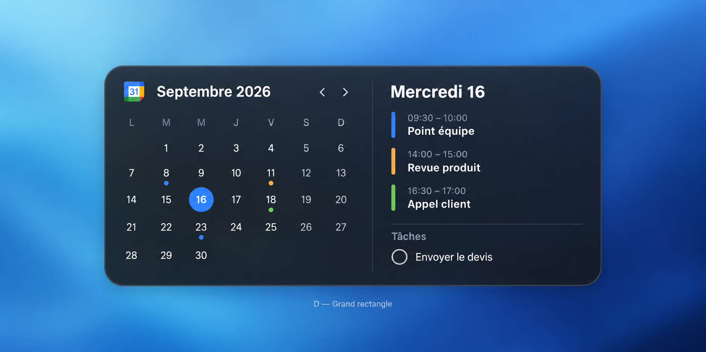

# MacWidgets

Native Mac desktop widgets for GitHub pull requests and Google Calendar. Built
with SwiftUI and WidgetKit. No iPhone required. No third-party runtime dependency.

Early development release. macOS 14+ deployment target; the initial design and
local checks target macOS 27. Public distribution and signed installation are
tracked separately from successful compilation. See [validation](docs/validation.md).



## Widgets

- **GitHub:** your open authored pull requests, repository, title, draft/check
  status and links. The count covers all accessible open authored PRs; the widget
  displays the most recently updated ones (up to two in compact layouts, five in
  the large layout).
- **Google Calendar:** month view with a selectable day, that day's events from
  your primary Google calendar and dated incomplete Google Tasks. Small square,
  medium rectangle, large square and extra-large landscape layouts.
- **Native appearance:** charcoal backgrounds, system fonts, calendar colors and
  WidgetKit-managed backgrounds. macOS controls tinting, transparency and exact
  widget dimensions; full-color mode is closest to the approved mockups.

The app contains clearly labeled fictional previews and real account connection
settings. Installed widgets never substitute fictional data for a missing account.

## Build and install

Open `MacWidgets.xcodeproj`, select your signing team for both targets, then build
and run the `MacWidgets` scheme. Launch the app at least once, connect accounts,
then right-click the desktop → **Edit Widgets** → **MacWidgets**.

The project is generated from `project.yml` using XcodeGen 2.46.0. Regenerate it
after changing the project specification:

```sh
brew install xcodegen
xcodegen generate
scripts/check.sh
```

The standalone Command Line Tools can run the local checks and render the SwiftUI
designs with `scripts/render-previews.sh`. The GitHub Actions build uses Apple's
full toolchain to package the app and widget extension, including App Intent
metadata. Downloading that build does not require installing Xcode on your Mac;
the CI artifact is unsigned and is **not a notarized public release**.

See [account setup and signing](docs/setup.md), [architecture and limitations](docs/architecture.md),
[approved designs](docs/design/README.md), and [validation status](docs/validation.md).

## Privacy

GitHub and Google tokens are stored in the macOS Keychain. Only the app and its
signed extension share access. Snapshots stay in a local App Group container.
Requests go directly to GitHub and Google; there is no intermediary service,
analytics, or remote storage. Calendar and task access is read-only.

## Contributing

Issues and pull requests are welcome. Keep widgets focused and use the existing
SwiftUI/WidgetKit infrastructure. Run `scripts/check.sh`, inspect native previews,
and update documentation when changing behavior. Never commit OAuth client files,
tokens, private snapshots, signing certificates or provisioning profiles.

## Credits

GitHub's PR layout takes inspiration from [GitStreak](https://github.com/wenujacodes/GitStreak).
This project has its own implementation and does not include GitStreak code or
assets. The GitHub mark comes from [Primer Octicons](https://github.com/primer/octicons),
under its [MIT license](docs/OCTICONS-LICENSE.txt). Google and GitHub names and marks
belong to their respective owners. MacWidgets is an independent project.

Source code: [MIT](LICENSE).
